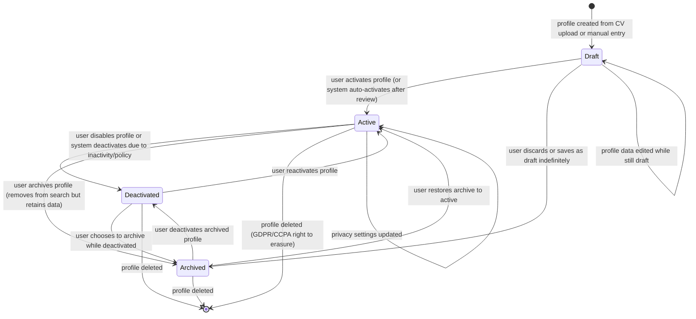

# Profile Lifecycle — State Diagram

```mermaid
stateDiagram-v2
    [*] --> Draft : profile created from CV upload or manual entry
    Draft --> Active : user activates profile (or system auto‑activates after review)
    Draft --> Archived : user discards or saves as draft indefinitely
    Active --> Deactivated : user disables profile or system deactivates due to inactivity/policy
    Active --> Archived : user archives profile (removes from search but retains data)
    Deactivated --> Active : user reactivates profile
    Deactivated --> Archived : user chooses to archive while deactivated
    Archived --> Active : user restores archive to active
    Archived --> Deactivated : user deactivates archived profile
    Active --> [*] : profile deleted (GDPR/CCPA right to erasure)
    Deactivated --> [*] : profile deleted
    Archived --> [*] : profile deleted

    %% Internal transitions (optional)
    Active --> Active : privacy settings updated
    Draft --> Draft : profile data edited while still draft
```