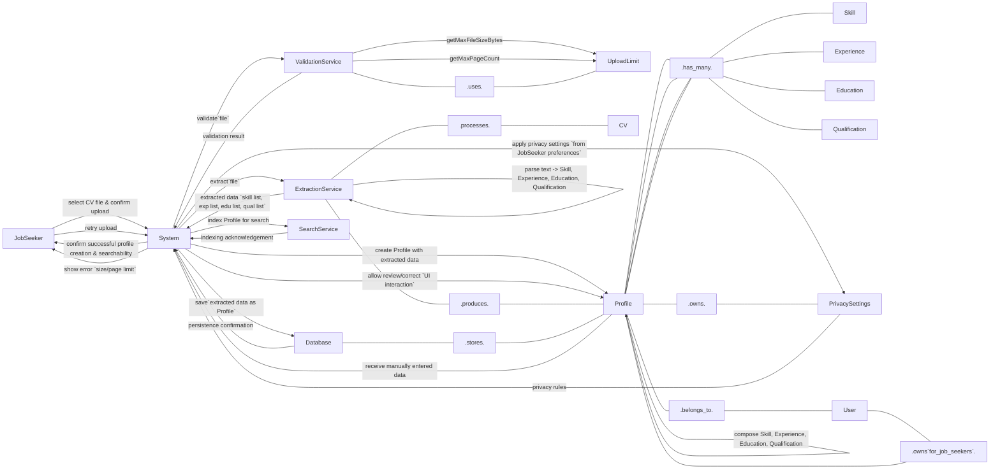

# Upload CV and Create Searchable Profile — Communication Diagram


```mermaid
flowchart LR
    %% Nodes
    JS[JobSeeker]
    Sys[System]
    VS[ValidationService]
    UL[UploadLimit]
    ES[ExtractionService]
    CV[CV]
    DB[Database]
    Prof[Profile]
    Skill[Skill]
    Exp[Experience]
    Edu[Education]
    Qual[Qualification]
    PS[PrivacySettings]
    SS[SearchService]
    U[User]

    %% Message links (solid arrows)
    JS -->|select CV file & confirm upload| Sys
    Sys -->|validate`file`| VS
    VS -->|getMaxFileSizeBytes| UL
    VS -->|getMaxPageCount| UL
    VS -->|validation result| Sys
    Sys -->|extract`file`| ES
    ES -->|parse text -> Skill, Experience, Education, Qualification| ES 
    ES -->|extracted data `skill list, exp list, edu list, qual list`| Sys
    Sys -->|save`extracted data as Profile`| DB
    DB -->|persistence confirmation| Sys
    Sys -->|create Profile with extracted data| Prof
    Prof -->|compose Skill, Experience, Education, Qualification| Prof 
    Sys -->|allow review/correct `UI interaction`| Prof
    Prof -->|receive manually entered data| Sys
    Sys -->|apply privacy settings `from JobSeeker preferences`| PS
    PS -->|privacy rules| Sys
    Sys -->|index Profile for search| SS
    SS -->|indexing acknowledgement| Sys
    Sys -->|confirm successful profile creation & searchability| JS
    %% Invalid flow
    Sys -->|show error `size/page limit`| JS
    JS -->|retry upload| Sys

    %% Structural links `dashed, labeled with relationship`
    VS ---.uses.--- UL
    ES ---.processes.--- CV
    ES ---.produces.--- Prof
    Prof ---.has_many.--- Skill
    Prof ---.has_many.--- Exp
    Prof ---.has_many.--- Edu
    Prof ---.has_many.--- Qual
    Prof ---.owns.--- PS
    Prof ---.belongs_to.--- U
    U ---.owns`for_job_seekers`.--- Prof
    DB ---.stores.--- Prof
    %% Note: CV is not persisted; it's transient input
```
```