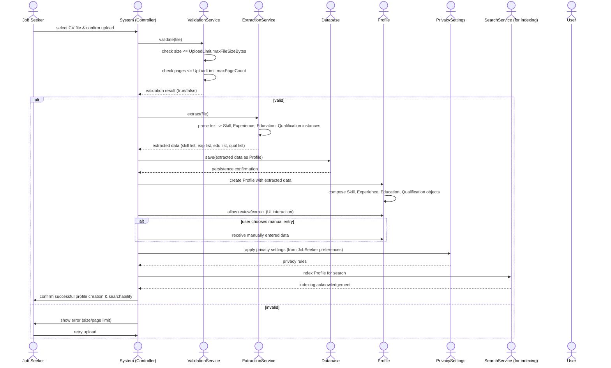

# Upload CV and Create Searchable Profile — Sequence Diagram (Main Flow)

```mermaid
sequenceDiagram
    Actor JobSeeker as Job Seeker
    Actor System as System (Controller)
    Actor VS as ValidationService
    Actor ES as ExtractionService
    Actor DB as Database
    Actor Prof as Profile
    Actor PS as PrivacySettings
    Actor SS as SearchService (for indexing)
    Actor U as User

    JobSeeker->>System: select CV file & confirm upload
    System->>VS: validate(file)
    VS->>VS: check size <= UploadLimit.maxFileSizeBytes
    VS->>VS: check pages <= UploadLimit.maxPageCount
    VS-->>System: validation result (true/false)
    alt valid
        System->>ES: extract(file)
        ES->>ES: parse text -> Skill, Experience, Education, Qualification instances
        ES-->>System: extracted data (skill list, exp list, edu list, qual list)
        System->>DB: save(extracted data as Profile)
        DB-->>System: persistence confirmation
        System->>Prof: create Profile with extracted data
        Prof->>Prof: compose Skill, Experience, Education, Qualification objects
        System->>Prof: allow review/correct (UI interaction)
        alt user chooses manual entry
            System->>Prof: receive manually entered data
        end
        System->>PS: apply privacy settings (from JobSeeker preferences)
        PS-->>System: privacy rules
        System->>SS: index Profile for search
        SS-->>System: indexing acknowledgement
        System->>JobSeeker: confirm successful profile creation & searchability
    else invalid
        System->>JobSeeker: show error (size/page limit)
        JobSeeker->>System: retry upload
    end
```