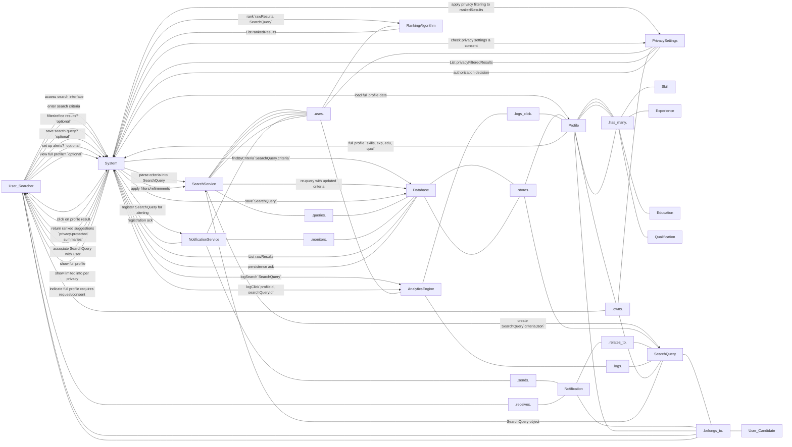

# Search for Qualifications and Get Candidate Suggestions — Communication Diagram


```mermaid
flowchart LR
    %% Nodes
    US[User_Searcher]
    UC[User_Candidate]
    Sys[System]
    SS[SearchService]
    DB[Database]
    RA[RankingAlgorithm]
    PS[PrivacySettings]
    Prof[Profile]
    Skill[Skill]
    Exp[Experience]
    Edu[Education]
    Qual[Qualification]
    SQ[SearchQuery]
    NS[NotificationService]
    Notif[Notification]
    AE[AnalyticsEngine]

    %% Message links `solid arrows`
    US -->|access search interface| Sys
    US -->|enter search criteria| Sys
    Sys -->|parse criteria into SearchQuery| SS
    SS -->|create SearchQuery`criteriaJson`| SQ
    SQ -->|SearchQuery object| SS
    Sys -->|logSearch`SearchQuery`| AE
    Sys -->|findByCriteria`SearchQuery.criteria`| DB
    DB -->|List<Profile> rawResults| Sys
    Sys -->|rank`rawResults, SearchQuery`| RA
    RA -->|List<Profile> rankedResults| Sys
    Sys -->|apply privacy filtering to rankedResults| PS
    PS -->|List<Profile> privacyFilteredResults| Sys
    Sys -->|return ranked suggestions `privacy-protected summaries`| US
    %% Optional filter/refine
    US -->|filter/refine results? `optional`| Sys
    Sys -->|apply filters/refinements| SS
    SS -->|re-query with updated criteria| DB
    %% Optional save search query
    US -->|save search query? `optional`| Sys
    Sys -->|save`SearchQuery`| DB
    DB -->|persistence ack| Sys
    Sys -->|associate SearchQuery with User| US
    US -->|set up alerts? `optional`| Sys
    Sys -->|register SearchQuery for alerting| NS
    NS -->|registration ack| Sys
    %% Optional view full profile
    US -->|view full profile? `optional`| Sys
    Sys -->|check privacy settings & consent| PS
    PS -->|authorization decision| Sys
    %% authorized path
    Sys -->|load full profile data| Prof
    Prof -->|full profile `skills, exp, edu, qual`| Sys
    Sys -->|show full profile| US
    %% not authorized path
    Sys -->|show limited info per privacy| US
    Sys -->|indicate full profile requires request/consent| US
    %% click on profile result
    US -->|click on profile result| Sys
    Sys -->|logClick`profileId, searchQueryId`| AE

    %% Structural links `dashed, labeled with relationship`
    SS ---.queries.--- DB
    SS ---.uses.--- PS
    SS ---.uses.--- RA
    SS ---.uses.--- AE
    DB ---.stores.--- Prof
    DB ---.stores.--- SQ
    Prof ---.has_many.--- Skill
    Prof ---.has_many.--- Exp
    Prof ---.has_many.--- Edu
    Prof ---.has_many.--- Qual
    Prof ---.owns.--- PS
    SQ ---.belongs_to.--- US
    NS ---.monitors.--- DB
    NS ---.uses.--- SS
    NS ---.sends.--- Notif
    Notif ---.belongs_to.--- US
    Notif ---.relates_to.--- SQ
    AE ---.logs.--- SQ
    AE ---.logs_click.--- Prof
    US ---.owns.--- SQ
    US ---.receives.--- Notif
    Prof ---.belongs_to.--- UC
```
```