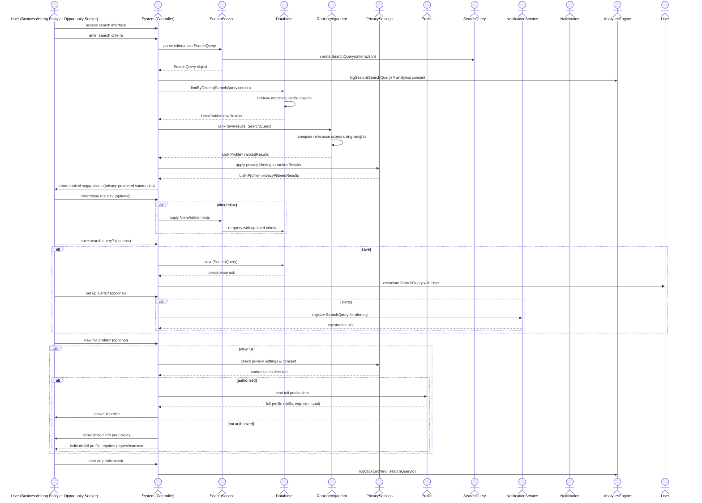

# Search for Qualifications and Get Candidate Suggestions — Sequence Diagram (Main Flow)

```mermaid
sequenceDiagram
    Actor user as User (Business/Hiring Entity or Opportunity Seeker)
    Actor Sys as System (Controller)
    Actor SS as SearchService
    Actor DB as Database
    Actor RA as RankingAlgorithm
    Actor PS as PrivacySettings
    Actor Prof as Profile
    Actor SQ as SearchQuery
    Actor NS as NotificationService
    Actor Notif as Notification
    Actor AE as AnalyticsEngine
    Actor U as User

    user->>Sys: access search interface
    user->>Sys: enter search criteria
    Sys->>SS: parse criteria into SearchQuery
    SS->>SQ: create SearchQuery(criteriaJson)
    SS-->>Sys: SearchQuery object
    Sys->>AE: logSearch(SearchQuery) // analytics consent
    Sys->>DB: findByCriteria(SearchQuery.criteria)
    DB->>DB: retrieve matching Profile objects
    DB-->>Sys: List<Profile> rawResults
    Sys->>RA: rank(rawResults, SearchQuery)
    RA->>RA: compute relevance scores using weights
    RA-->>Sys: List<Profile> rankedResults
    Sys->>PS: apply privacy filtering to rankedResults
    PS-->>Sys: List<Profile> privacyFilteredResults
    Sys->>user: return ranked suggestions (privacy-protected summaries)
    user->>Sys: filter/refine results? (optional)
    alt filter/refine
        Sys->>SS: apply filters/refinements
        SS->>DB: re-query with updated criteria
      
    end
    user->>Sys: save search query? (optional)
    alt save
        Sys->>DB: save(SearchQuery)
        DB-->>Sys: persistence ack
        Sys->>U: associate SearchQuery with User
        user->>Sys: set up alerts? (optional)
        alt alerts
            Sys->>NS: register SearchQuery for alerting
            NS-->>Sys: registration ack
            
        end
    end
    user->>Sys: view full profile? (optional)
    alt view full
        Sys->>PS: check privacy settings & consent
        PS-->>Sys: authorization decision
        alt authorized
            Sys->>Prof: load full profile data
            Prof-->>Sys: full profile (skills, exp, edu, qual)
            Sys->>user: show full profile
        else not authorized
            Sys->>user: show limited info per privacy
            Sys->>user: indicate full profile requires request/consent
        end
    end
    user->>Sys: click on profile result
    Sys->>AE: logClick(profileId, searchQueryId)
```