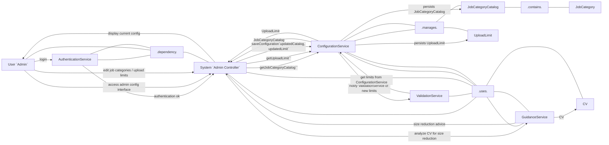

# Implement Job Categorization and CV Upload Limits — Communication Diagram


```mermaid
flowchart LR
    %% Nodes
    UA[User `Admin`]
    Sys[System `Admin Controller`]
    Auth[AuthenticationService]
    Config[ConfigurationService]
    Cat[JobCategoryCatalog]
    JC[JobCategory]
    Lim[UploadLimit]
    Val[ValidationService]
    Guid[GuidanceService]
    CV[CV]
    %% Message flow `solid lines`
    UA -->|login| Auth
    Auth -->|authentication ok| Sys
    UA -->|access admin config interface| Sys
    Sys -->|getJobCategoryCatalog``| Config
    Sys -->|getUploadLimit``| Config
    Config -->|JobCategoryCatalog| Sys
    Config -->|UploadLimit| Sys
    Sys -->|display current config| UA
    UA -->|edit job categories / upload limits| Sys
    Sys -->|saveConfiguration`updatedCatalog, updatedLimit`| Config
    Config -->|persists JobCategoryCatalog| Cat
    Config -->|persists UploadLimit| Lim
    Config -->|notify ValidationService of new limits| Val
    Val -->|get limits from ConfigurationService| Config
    %% Optional guidance path `if CV upload fails size limit in UC-001`
    Sys -->|analyze CV for size reduction| Guid
    Guid -->|CV| CV
    Guid -->|size reduction advice| Sys
    %% Structural links `dashed`
    Auth ---.dependency.--- Sys
    Sys ---.uses.--- Config
    Config ---.manages.--- Cat
    Config ---.manages.--- Lim
    Cat ---.contains.--- JC
    Val ---.uses.--- Config
    Guid ---.uses.--- CV
    Sys ---.uses.--- Guid
    UA ---.dependency.--- Auth
```
```