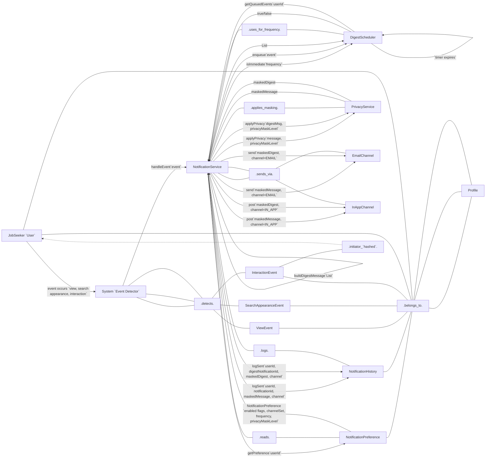

# Receive Notifications for Profile Views and Interactions — Communication Diagram


```mermaid
flowchart LR
    %% Nodes
    JS[JobSeeker `User`]
    Sys[System `Event Detector`]
    NS[NotificationService]
    NP[NotificationPreference]
    DS[DigestScheduler]
    PS[PrivacyService]
    EC[EmailChannel]
    IC[InAppChannel]
    NH[NotificationHistory]
    %% Events `could be shown as separate objects or passed as parameters`
    VE[ViewEvent]
    SAE[SearchAppearanceEvent]
    IE[InteractionEvent]

    %% Message links `solid arrows` - main flow
    JS -->|event occurs `view, search appearance, interaction`| Sys
    Sys -->|handleEvent`event`| NS
    NS -->|getPreference`userId`| NP
    NP -->|NotificationPreference `enabled flags, channelSet, frequency, privacyMaskLevel`| NS
    %% Decision: event type disabled?
    NS -->|isImmediate`frequency`| DS
    DS -->|true/false| NS
    %% Immediate path
    NS -->|buildBaseMessage`event`| NS 
    NS -->|applyPrivacy`message, privacyMaskLevel`| PS
    PS -->|maskedMessage| NS
    NS -->|send`maskedMessage, channel=EMAIL`| EC
    NS -->|post`maskedMessage, channel=IN_APP`| IC
    NS -->|logSent`userId, notificationId, maskedMessage, channel`| NH
    %% Digest path `alternative`
    NS -->|enqueue`event`| DS
    DS -->|`timer expires`| DS 
    DS -->|getQueuedEvents`userId`| NS
    NS -->|List<Event>| DS
    NS -->|buildDigestMessage`List<Event>`| NS 
    NS -->|applyPrivacy`digestMsg, privacyMaskLevel`| PS
    PS -->|maskedDigest| NS
    NS -->|send`maskedDigest, channel=EMAIL`| EC
    NS -->|post`maskedDigest, channel=IN_APP`| IC
    NS -->|logSent`userId, digestNotificationId, maskedDigest, channel`| NH

    %% Structural links `dashed, labeled with relationship`
    Sys ---.detects.--- VE
    Sys ---.detects.--- SAE
    Sys ---.detects.--- IE
    NS ---.reads.--- NP
    NS ---.uses_for_frequency.--- DS
    NS ---.applies_masking.--- PS
    NS ---.sends_via.--- EC
    NS ---.sends_via.--- IC
    NS ---.logs.--- NH
    NP ---.belongs_to.--- JS
    NH ---.belongs_to.--- JS
    VE ---.belongs_to.--- Profile 
    SAE ---.belongs_to.--- Profile
    IE ---.belongs_to.--- Profile
    IE ---.initiator_`hashed`.-.-> JS 
```
```