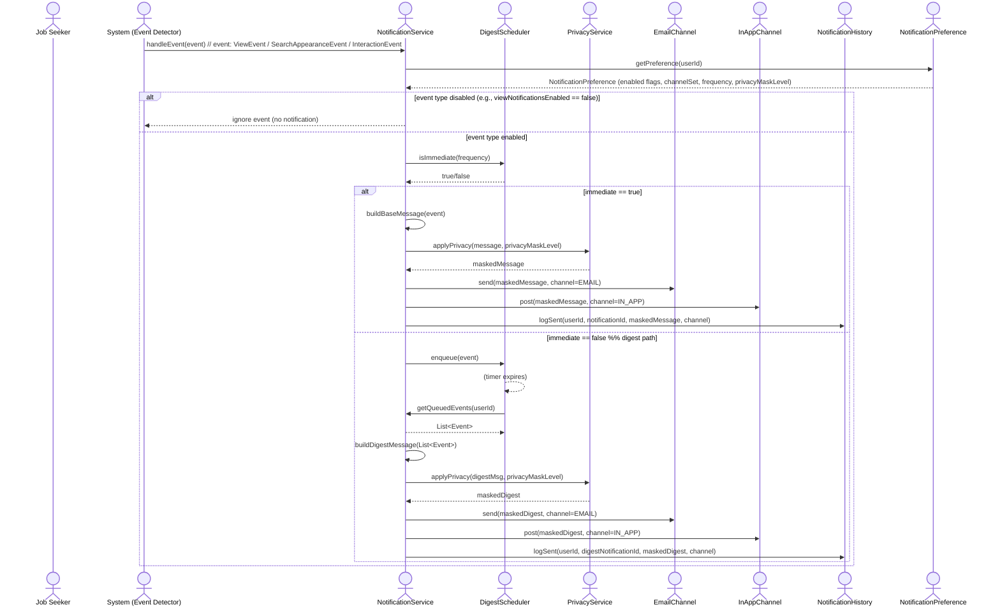

# Receive Notifications for Profile Views and Interactions — Sequence Diagram (Main Flow)

```mermaid
sequenceDiagram
    Actor User as Job Seeker
    Actor Sys as System (Event Detector)
    Actor NS as NotificationService
    Actor DS as DigestScheduler
    Actor PS as PrivacyService
    Actor EC as EmailChannel
    Actor IC as InAppChannel
    Actor NH as NotificationHistory
    Actor NP as NotificationPreference

    %% Event occurs (view, search appearance, or interaction)
    Sys->>NS: handleEvent(event)   // event: ViewEvent / SearchAppearanceEvent / InteractionEvent
    NS->>NP: getPreference(userId)
    NP-->>NS: NotificationPreference (enabled flags, channelSet, frequency, privacyMaskLevel)

    alt event type disabled (e.g., viewNotificationsEnabled == false)
        NS-->>Sys: ignore event (no notification)
    else event type enabled
        NS->>DS: isImmediate(frequency)
        DS-->>NS: true/false

        alt immediate == true
            %% Build base message
            NS->>NS: buildBaseMessage(event)
            NS->>PS: applyPrivacy(message, privacyMaskLevel)
            PS-->>NS: maskedMessage
            NS->>EC: send(maskedMessage, channel=EMAIL)
            NS->>IC: post(maskedMessage, channel=IN_APP)
            NS->>NH: logSent(userId, notificationId, maskedMessage, channel)
        else immediate == false   %% digest path
            NS->>DS: enqueue(event)
            %% DigestScheduler waits for timer (daily/weekly)
            DS-->>DS: (timer expires)
            DS->>NS: getQueuedEvents(userId)
            NS-->>DS: List<Event>
            NS->>NS: buildDigestMessage(List<Event>)
            NS->>PS: applyPrivacy(digestMsg, privacyMaskLevel)
            PS-->>NS: maskedDigest
            NS->>EC: send(maskedDigest, channel=EMAIL)
            NS->>IC: post(maskedDigest, channel=IN_APP)
            NS->>NH: logSent(userId, digestNotificationId, maskedDigest, channel)
        end
    end
```