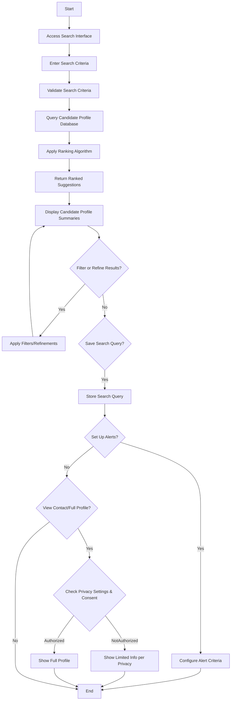

# Search for Qualifications and Get Candidate Suggestions

## General info

- **Primary actor:** Business/Hiring Entity or Opportunity Seeker
- **Secondary actors:** System (for search, ranking, privacy filtering)
- **Trigger:** Actor initiates a search for specific qualifications, skills, experience, or education criteria.
- **Preconditions:** 
  - System has indexed candidate profiles from uploaded CVs
  - Actor has accessed the search functionality
  - System is operational and ready to process search queries
- **Postconditions:** 
  - System returns ranked suggestions of matching candidates
  - Actor can view candidate profile summaries (with privacy-protected sensitive information)
  - Actor can refine or filter search results
  - Actor can save search query or set up alerts for new matching candidates
- **Business rules:** 
  - BR-001: Only authorized personnel may view full profile details (others see summaries)
  - BR-002: Deactivated profiles are not visible in search results
  - BR-007: Search results must comply with GDPR/CCPA regarding personal data display
  - BR-008: Sensitive personal information (contact details, ID numbers, current salary) not displayed unless explicitly shared by profile owner
  - BR-009: Authentication required to access search functionality
  - BR-010: Search query logging for analytics subject to privacy consent

## Description

### Main flow

1. Actor accesses search interface for qualifications, skills, experience, education criteria
2. Actor enters search criteria (e.g., skills: "Python, ML"; experience: "3-5 years"; education: "Bachelor's")
3. System validates search criteria for basic consistency
4. System queries the candidate profile database based on search criteria
5. System applies ranking algorithm to order results by relevance
6. System returns ranked suggestions of matching candidates
7. System displays candidate profile summaries (with privacy-protected sensitive information)
8. Actor can filter or refine search results (e.g., by location, experience level)
9. Actor can save the search query for future reuse
10. Actor can set up alerts for new matching candidates matching the criteria
11. Actor can initiate contact or view full profile (subject to privacy settings and consent)

### Alternate flows

**A1 — No Matching Candidates Found**
- If query returns zero results at step 6:
  - System informs actor that no candidates match the criteria
  - System suggests broadening search criteria or checking spelling
  - Use case ends

**A2 — Privacy Filtering Applied**
- If candidate profile has privacy restrictions that hide certain information:
  - System displays only non-sensitive summary information
  - System indicates that full profile requires viewer to request access or that information is hidden per privacy settings

**A3 — Search Query Too Broad/Narrow**
- If query returns excessively large (>1000) or small (<1) result set:
  - System provides feedback to actor about result set size
  - System suggests adjusting criteria (add more specifics for too broad, remove criteria for too narrow)
  - Actor can adjust and resubmit

**A4 — Technical Error in Search**
- If search service encounters technical issue (timeout, database error):
  - System displays error message and suggests retrying after a brief wait
  - System logs error for administrator review

## Activity diagram

