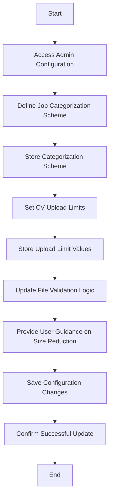

# Implement Job Categorization and CV Upload Limits

## General info

- **Primary actor:** System Administrator
- **Secondary actors:** System (for validation, storage, enforcement)
- **Trigger:** System Administrator configures job categorization scheme and CV upload limits during system setup or maintenance.
- **Preconditions:** 
  - System Administrator has accessed administrative configuration interface
  - System is operational and ready to accept configuration changes
  - No active CV uploads are being processed (or changes apply to future uploads)
- **Postconditions:** 
  - Job categorization/classification system is defined and stored
  - CV upload limits (maximum file size, maximum pages) are defined and stored
  - Validation rules are updated to enforce limits during upload
  - System provides guidance to users on how to reduce CV size if needed
- **Business rules:** 
  - BR-003: CV uploads limited to maximum file size of 5 MB and maximum of 5 pages
  - BR-007: System shall provide clear error messages when upload limits are exceeded
  - BR-009: Only authorized administrators can modify categorization and upload limit settings
  - BR-010: Changes to categorization or limits apply only to future uploads, not retroactively to existing profiles

## Description

### Main flow

1. System Administrator accesses administrative configuration interface for job categorization and upload limits
2. System Administrator defines job categorization/classification system (e.g., by industry, role type, skill domain)
3. System stores categorization scheme and makes it available for browsing/searching opportunities
4. System Administrator defines CV upload limits: maximum file size (e.g., 5 MB) and maximum page count (e.g., 5 pages)
5. System stores upload limit values
6. System updates file validation logic to enforce size and page count limits during CV upload
7. System provides user guidance on how to reduce CV size (e.g., compress images, remove unnecessary pages)
8. System Administrator saves configuration changes
9. System confirms successful update of categorization and upload limit settings

### Alternate flows

**A1 — Invalid Categorization Scheme**
- If Administrator enters an invalid or incomplete categorization scheme:
  - System provides validation feedback (e.g., missing required fields, duplicate categories)
  - Administrator corrects categorization scheme and retries
  - Use case returns to step 2

**A2 — Invalid Upload Limit Values**
- If Administrator enters non-numeric, negative, or zero values for size or page limits:
  - System provides error message indicating valid numeric ranges required
  - Administrator corrects values and retries
  - Use case returns to step 4

**A3 — Guidance Generation Failure**
- If system fails to generate size reduction guidance:
  - System logs error and provides generic guidance (e.g., "reduce file size")
  - Use case continues to completion

**A4 — Configuration Save Failure**
- If system fails to save configuration changes:
  - System displays error message and suggests retrying
  - System logs error for administrator review
  - Use case ends without saving changes

## Activity diagram

