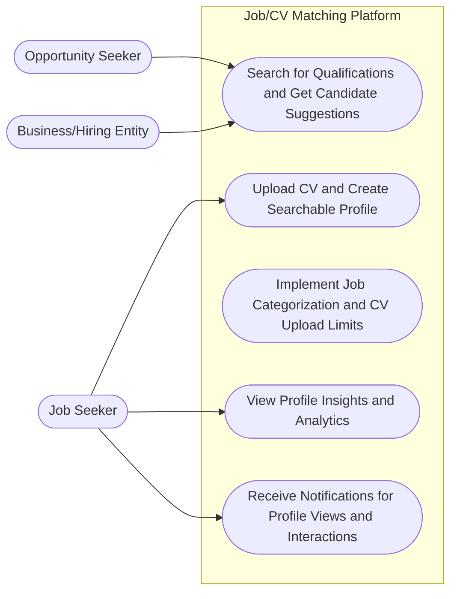

```mermaid
flowchart LR
    JobSeeker([Job Seeker])
    OpportunitySeeker([Opportunity Seeker])
    Business([Business/Hiring Entity])

    subgraph JobCVMatchingPlatform [Job/CV Matching Platform]
        UC1([Upload CV and Create Searchable Profile])
        UC2([Search for Qualifications and Get Candidate Suggestions])
        UC3([Implement Job Categorization and CV Upload Limits])
        UC4([View Profile Insights and Analytics])
        UC5([Receive Notifications for Profile Views and Interactions])
    end

    JobSeeker --> UC1
    JobSeeker --> UC4
    JobSeeker --> UC5
    OpportunitySeeker --> UC2
    Business --> UC2
```