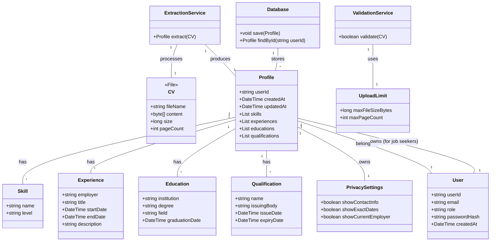

# Upload CV and Create Searchable Profile — Structural View

Classes touched by this use case, refined from `rough-work.md` and verified by role-playing this use case's main flow against each card.

## CRC Cards

### CV
**Type:** Concrete, Domain
**Description:** Represents the uploaded Curriculum Vitae file containing professional information.
**Associated Use Cases:** UC-001

| Responsibilities | Collaborators |
|---|---|
| Provide file content for validation | ValidationService |
| Provide raw text/data for extraction | ExtractionService |

**Attributes:** fileName(string), content(byte[]), size(long), pageCount(int)

### ValidationService
**Type:** Concrete, Service
**Description:** Validates uploaded CV files against size and page limits.
**Associated Use Cases:** UC-001, UC-003

| Responsibilities | Collaborators |
|---|---|
| Validate file size <= limit | UploadLimit |
| Validate page count <= limit | UploadLimit |
| Return validation result | CV (caller) |

**Attributes:** none
**Relationships:**
- Depends on: UploadLimit

### ExtractionService
**Type:** Concrete, Service
**Description:** Extracts structured qualification data (skills, experience, education, qualifications) from CV text.
**Associated Use Cases:** UC-001

| Responsibilities | Collaborators |
|---|---|
| Parse CV text to identify skills | Skill |
| Parse CV text to identify experience | Experience |
| Parse CV text to identify education | Education |
| Parse CV text to identify qualifications | Qualification |
| Return extracted data profile | Profile |

**Attributes:** none
**Relationships:**
- Uses: Skill, Experience, Education, Qualification (as output types)

### Database
**Type:** Concrete, Infrastructure
**Description:** Persistent storage for candidate profiles and related data.
**Associated Use Cases:** UC-001, UC-002, UC-004, UC-005

| Responsibilities | Collaborators |
|---|---|
| Store Profile objects | Profile |
| Retrieve Profile objects for search | SearchService |
| Retrieve Profile objects for analytics | AnalyticsEngine |
| Store ViewEvent, Notification, SearchQuery | ViewEvent, Notification, SearchQuery |

**Attributes:** connectionString(string)
**Relationships:**
- Manages: Profile, ViewEvent, Notification, SearchQuery

### Profile
**Type:** Concrete, Domain
**Description:** Represents a job seeker's professional profile derived from CV data.
**Associated Use Cases:** UC-001, UC-002, UC-004, UC-005

| Responsibilities | Collaborators |
|---|---|
| Hold aggregated qualification data | Skill, Experience, Education, Qualification |
| Manage privacy settings | PrivacySettings |
| Link to owning User | User |
| Provide data for search indexing | SearchService |
| Provide data for analytics | AnalyticsEngine |

**Attributes:** userId(foreign key), createdAt(date), updatedAt(date)
**Relationships:**
- Composition: has many Skill
- Composition: has many Experience
- Composition: has many Education
- Composition: has many Qualification
- Association: belongs to User
- Aggregation: has PrivacySettings

### Skill
**Type:** Concrete, Domain
**Description:** A professional capability possessed by a job seeker.
**Associated Use Cases:** UC-001, UC-002

| Responsibilities | Collaborators |
|---|---|
| Describe skill name and proficiency level | — |
| Be searched via keyword matching | SearchService |

**Attributes:** name(string), level(string)
**Relationships:**
- Part of: Profile

### Experience
**Type:** Concrete, Domain
**Description:** A period of professional employment.
**Associated Use Cases:** UC-001, UC-002

| Responsibilities | Collaborators |
|---|---|
| Record employer, role, dates, responsibilities | — |
| Be searched via employer, role, date ranges | SearchService |

**Attributes:** employer(string), title(string), startDate(date), endDate(date), description(string)
**Relationships:**
- Part of: Profile

### Education
**Type:** Concrete, Domain
**Description:** Formal academic qualification.
**Associated Use Cases:** UC-001, UC-002

| Responsibilities | Collaborators |
|---|---|
| Record institution, degree, field, dates | — |
| Be searched via institution, degree, field | SearchService |

**Attributes:** institution(string), degree(string), field(string), graduationDate(date)
**Relationships:**
- Part of: Profile

### Qualification
**Type:** Concrete, Domain
**Description:** Certification, license, or other credential.
**Associated Use Cases:** UC-001, UC-002

| Responsibilities | Collaborators |
|---|---|
| Record issuing body, name, dates | — |
| Be searched via name, issuing body | SearchService |

**Attributes:** name(string), issuingBody(string), issueDate(date), expiryDate(date)
**Relationships:**
- Part of: Profile

### PrivacySettings
**Type:** Concrete, Domain
**Description:** Controls what profile information is visible to others.
**Associated Use Cases:** UC-001, UC-002, UC-004, UC-005

| Responsibilities | Collaborators |
|---|---|
| Define visibility rules for profile fields | Profile |
| Determine what data to show in search results | SearchService |
| Determine what data to show in notifications | NotificationService |

**Attributes:** showContactInfo(boolean), showExactDates(boolean), showCurrentEmployer(boolean)
**Relationships:**
- Belongs to: Profile

### User
**Type:** Concrete, Domain
**Description:** Actor who interacts with the system (job seeker, opportunity seeker, business, administrator).
**Associated Use Cases:** UC-001, UC-002, UC-003, UC-004, UC-005

| Responsibilities | Collaborators |
|---|---|
| Own one or more Profiles (for job seekers) | Profile |
| Authenticate via credentials | AuthenticationService |
| Perform actions per role | — |

**Attributes:** userId(string), email(string), role(enum: JOB_SEEKER, OPPORTUNITY_SEEKER, BUSINESS, ADMIN), passwordHash(string), createdAt(date)
**Relationships:**
- One-to-many: Profile (for job seekers)
- Dependency: AuthenticationService

### UploadLimit
**Type:** Concrete, Domain
**Description:** Defines maximum allowed file size and page count for CV uploads.
**Associated Use Cases:** UC-001, UC-003

| Responsibilities | Collaborators |
|---|---|
| Provide max size limit (bytes) | ValidationService |
| Provide max page count | ValidationService |

**Attributes:** maxFileSizeBytes(long), maxPageCount(int)
**Relationships:**
- Used by: ValidationService

## Class diagram (this use case's slice)
