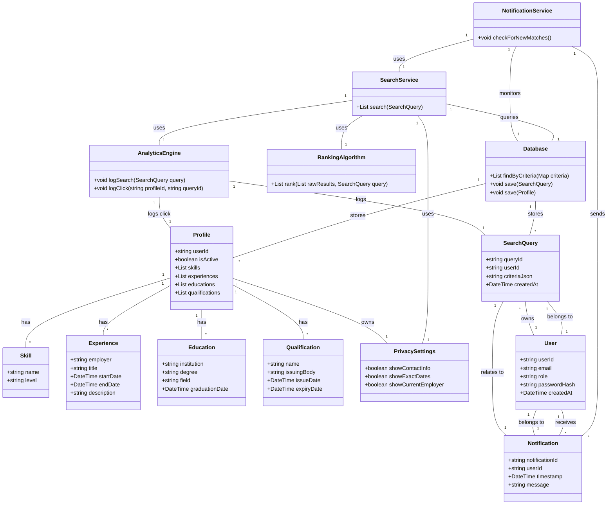

# Search for Qualifications and Get Candidate Suggestions — Structural View

Classes touched by this use case, refined from `rough-work.md` and verified by role-playing this use case's main flow against each card.

## CRC Cards

### SearchService
**Type:** Concrete, Service  
**Description:** Executes search queries against candidate profiles and applies ranking.  
**Associated Use Cases:** UC-002  

| Responsibilities | Collaborators |
|---|---|
| Parse search criteria into query | SearchQuery |
| Retrieve matching profiles from database | Database |
| Apply ranking algorithm to results | RankingAlgorithm |
| Apply privacy filtering to profile summaries | PrivacySettings |
| Return ranked suggestions | — |

**Attributes:** none  
**Relationships:**  
- Uses: Database, RankingAlgorithm, PrivacySettings  

### Database
**Type:** Concrete, Infrastructure  
**Description:** Persistent storage for candidate profiles and related data.  
**Associated Use Cases:** UC-001, UC-002, UC-004, UC-005  

| Responsibilities | Collaborators |
|---|---|
| Store Profile objects | Profile |
| Retrieve Profile objects matching query | SearchService |
| Store SearchQuery for analytics | SearchQuery |
| Store ViewEvent, Notification | ViewEvent, Notification |

**Attributes:** connectionString(string)  
**Relationships:**  
- Manages: Profile, SearchQuery, ViewEvent, Notification  

### Profile
**Type:** Concrete, Domain  
**Description:** Represents a job seeker's professional profile derived from CV data.  
**Associated Use Cases:** UC-001, UC-002, UC-004, UC-005  

| Responsibilities | Collaborators |
|---|---|
| Hold qualification data for matching | Skill, Experience, Education, Qualification |
| Enforce privacy settings on data exposure | PrivacySettings |
| Provide searchable text for indexing | SearchService |

**Attributes:** userId(foreign key), createdAt(date), updatedAt(date), isActive(boolean)  
**Relationships:**  
- Composition: has many Skill  
- Composition: has many Experience  
- Composition: has many Education  
- Composition: has many Qualification  
- Association: belongs to User  
- Aggregation: has PrivacySettings  

### Skill
**Type:** Concrete, Domain  
**Description:** A professional capability possessed by a job seeker.  
**Associated Use Cases:** UC-001, UC-002  

| Responsibilities | Collaborators |
|---|---|
| Match against search keywords | SearchService |
| Provide name and proficiency level | — |

**Attributes:** name(string), level(string)  
**Relationships:**  
- Part of: Profile  

### Experience
**Type:** Concrete, Domain  
**Description:** A period of professional employment.  
**Associated Use Cases:** UC-001, UC-002  

| Responsibilities | Collaborators |
|---|---|
| Match against employer, role, date ranges | SearchService |
| Record employment details | — |

**Attributes:** employer(string), title(string), startDate(date), endDate(date), description(string)  
**Relationships:**  
- Part of: Profile  

### Education
**Type:** Concrete, Domain  
**Description:** Formal academic qualification.  
**Associated Use Cases:** UC-001, UC-002  

| Responsibilities | Collaborators |
|---|---|
| Match against institution, degree, field | SearchService |
| Record academic details | — |

**Attributes:** institution(string), degree(string), field(string), graduationDate(date)  
**Relationships:**  
- Part of: Profile  

### Qualification
**Type:** Concrete, Domain  
**Description:** Certification, license, or other credential.  
**Associated Use Cases:** UC-001, UC-002  

| Responsibilities | Collaborators |
|---|---|
| Match against name, issuing body | SearchService |
| Record credential details | — |

**Attributes:** name(string), issuingBody(string), issueDate(date), expiryDate(date)  
**Relationships:**  
- Part of: Profile  

### PrivacySettings
**Type:** Concrete, Domain  
**Description:** Controls what profile information is visible to others.  
**Associated Use Cases:** UC-001, UC-002, UC-004, UC-005  

| Responsibilities | Collaborators |
|---|---|
| Determine which fields to show in search results | SearchService |
| Define visibility rules for profile fields | Profile |

**Attributes:** showContactInfo(boolean), showExactDates(boolean), showCurrentEmployer(boolean)  
**Relationships:**  
- Belongs to: Profile  

### SearchQuery
**Type:** Concrete, Domain  
**Description:** A saved search specification for reuse or alerting.  
**Associated Use Cases:** UC-002  

| Responsibilities | Collaborators |
|---|---|
| Store search criteria (skills, experience, etc.) | — |
| Provide criteria for repeated execution | SearchService |
| Trigger alert generation when new matches appear | NotificationService |

**Attributes:** queryId(string), userId(foreign key), criteriaJson(string), createdAt(date)  
**Relationships:**  
- Belongs to: User  
- Used by: SearchService, NotificationService  

### NotificationService
**Type:** Concrete, Service  
**Description:** Generates alerts for new matching candidates based on saved searches.  
**Associated Use Cases:** UC-002, UC-005  

| Responsibilities | Collaborators |
|---|---|
| Monitor database for new profiles matching saved SearchQuery | Database, SearchService |
| Generate Notification objects for matches | Notification |
| Send notifications via configured channel | — |

**Attributes:** none  
**Relationships:**  
- Uses: Database, SearchService  
- Produces: Notification  

### Notification
**Type:** Concrete, Domain  
**Description:** Alert informing user of new matching candidates.  
**Associated Use Cases:** UC-002, UC-005  

| Responsibilities | Collaborators |
|---|---|
| Contain summary of new matches | SearchService |
| Indicate link to view full results | — |
| Respect user privacy preferences | PrivacySettings |

**Attributes:** notificationId(string), userId(foreign key), timestamp(date), message(string), relatedSearchQueryId(foreign key)  
**Relationships:**  
- Belongs to: User  
- References: SearchQuery  

### RankingAlgorithm
**Type:** Concrete, Service  
**Description:** Scores and orders search results by relevance.  
**Associated Use Cases:** UC-002  

| Responsibilities | Collaborators |
|---|---|
| Assign weight to skills, experience, education, qualifications | — |
| Compute relevance score for each profile | Profile |
| Return ordered list | SearchService |

**Attributes:** weights(map[string]float)  
**Relationships:**  
- Used by: SearchService  

### AnalyticsEngine
**Type:** Concrete, Service  
**Description:** Logs search queries and clicks for analytics (subject to privacy consent).  
**Associated Use Cases:** UC-002, UC-004, UC-005  

| Responsibilities | Collaborators |
|---|---|
| Record executed SearchQuery | SearchQuery |
| Record click-through on search results | Profile, SearchService |
| Provide aggregated metrics | — |

**Attributes:** none  
**Relationships:**  
- Uses: SearchQuery, Profile, SearchService  

### User
**Type:** Concrete, Domain  
**Description:** Actor who interacts with the system (job seeker, opportunity seeker, business, administrator).  
**Associated Use Cases:** UC-001, UC-002, UC-003, UC-004, UC-005  

| Responsibilities | Collaborators |
|---|---|
| Own saved SearchQueries | SearchQuery |
| Receive Notifications for matches | Notification |
| Authenticate via credentials | AuthenticationService |

**Attributes:** userId(string), email(string), role(enum: JOB_SEEKER, OPPORTUNITY_SEEKER, BUSINESS, ADMIN), passwordHash(string), createdAt(date)  
**Relationships:**  
- One-to-many: SearchQuery  
- One-to-many: Notification  
- Dependency: AuthenticationService  

## Class diagram (this use case's slice)
