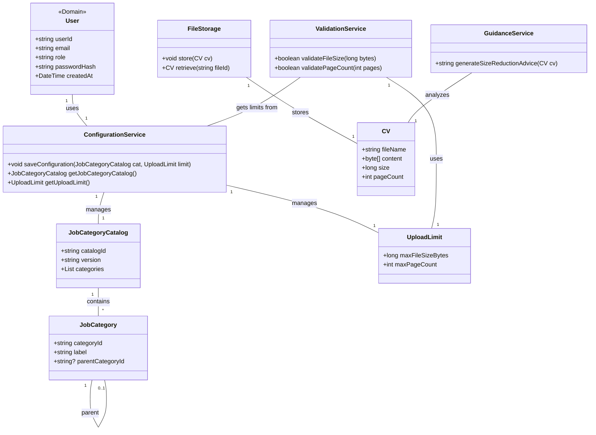

# Implement Job Categorization and CV Upload Limits — Structural View

Classes touched by this use case, refined from `rough-work.md` and verified by role-playing this use case's main flow against each card.

## CRC Cards

### User (as System Administrator)
**Type:** Concrete, Domain  
**Description:** Actor with ADMIN role who can modify system configuration.  
**Associated Use Cases:** UC-001, UC-002, UC-003, UC-004, UC-005  

| Responsibilities | Collaborators |
|---|---|
| Authenticate via credentials | AuthenticationService |
| Access administrative configuration interface | — |
| Save categorization and upload limit changes | ConfigurationService |

**Attributes:** userId(string), email(string), role(enum: JOB_SEEKER, OPPORTUNITY_SEEKER, BUSINESS, ADMIN), passwordHash(string), createdAt(date)  
**Relationships:**  
- Dependency: AuthenticationService  
- One-to-many: UploadLimit (if we store per-admin, but likely global) – we treat as global config.

### ConfigurationService
**Type:** Concrete, Service  
**Description:** Persists and retrieves system-wide configuration such as job categorization and upload limits.  
**Associated Use Cases:** UC-003  

| Responsibilities | Collaborators |
|---|---|
| Store job categorization scheme | JobCategoryCatalog |
| Store CV upload limit values | UploadLimit |
| Provide current configuration to validation logic | ValidationService |
| Log configuration changes | AuditLog (optional) |

**Attributes:** none  
**Relationships:**  
- Manages: JobCategoryCatalog, UploadLimit  
- Used by: ValidationService  

### JobCategoryCatalog
**Type:** Concrete, Domain  
**Description:** Defines the hierarchical or flat classification of jobs/opportunities (e.g., by industry, role, skill).  
**Associated Use Cases:** UC-002, UC-003  

| Responsibilities | Collaborators |
|---|---|
| Store category identifiers and descriptions | — |
| Validate category references during upload/search | ValidationService, SearchService |
| Provide browsable hierarchy for users | — |

**Attributes:** catalogId(string), version(string)  
**Relationships:**  
- One-to-many: JobCategory  

### JobCategory
**Type:** Concrete, Domain  
**Description:** A single classification entry (e.g., "Software Engineering", "Healthcare").  
**Associated Use Cases:** UC-002, UC-003, UC-004  

| Responsibilities | Collaborators |
|---|---|
| Provide ID and label for categorization | — |
| Indicate parent category for hierarchy | JobCategory |

**Attributes:** categoryId(string), label(string), parentCategoryId(string, optional)  
**Relationships:**  
- Part of: JobCategoryCatalog  
- Optional aggregation: parent JobCategory  

### UploadLimit
**Type:** Concrete, Domain  
**Description:** Defines maximum allowed file size and page count for CV uploads.  
**Associated Use Cases:** UC-001, UC-003  

| Responsibilities | Collaborators |
|---|---|
| Provide max size limit (bytes) | ValidationService |
| Provide max page count | ValidationService |

**Attributes:** maxFileSizeBytes(long), maxPageCount(int)  
**Relationships:**  
- Used by: ValidationService, ConfigurationService  

### ValidationService
**Type:** Concrete, Service  
**Description:** Validates uploaded CV files against size and page limits.  
**Associated Use Cases:** UC-001, UC-003  

| Responsibilities | Collaborators |
|---|---|
| Validate file size <= limit | UploadLimit |
| Validate page count <= limit | UploadLimit |
| Return validation result | CV (caller) |

**Attributes:** none  
**Relationships:**  
- Depends on: UploadLimit  
- Uses: ConfigurationService (to get current limits)  

### FileStorage
**Type:** Concrete, Infrastructure  
**Description:** Stores binary files such as uploaded CVs.  
**Associated Use Cases:** UC-001, UC-003  

| Responsibilities | Collaborators |
|---|---|
| Save uploaded CV file | CV |
| Retrieve CV file for reprocessing | CV |
| Enforce storage quotas | — |

**Attributes:** storageRoot(string)  
**Relationships:**  
- Manages: CV binary data  

### GuidanceService
**Type:** Concrete, Service  
**Description:** Generates suggestions for reducing CV file size (e.g., compress images, remove pages).  
**Associated Use Cases:** UC-003  

| Responsibilities | Collaborators |
|---|---|
| Analyze CV file for size reduction opportunities | CV |
| Return user‑friendly guidance text | — |

**Attributes:** none  
**Relationships:**  
- Uses: CV  

## Class diagram (this use case's slice)
