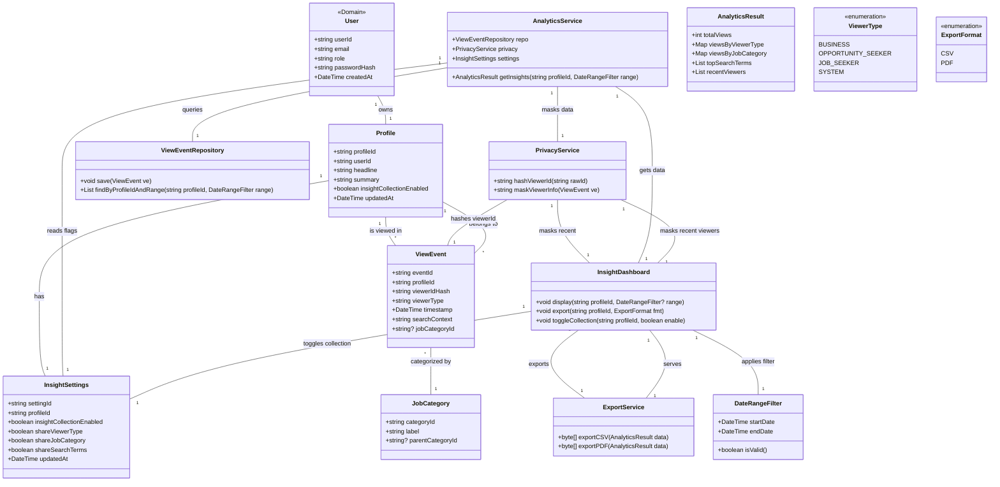

# View Profile Insights and Analytics — Structural View

Classes touched by this use case, refined from `rough-work.md` and verified by role-playing this use case's main flow against each card.

## CRC Cards

### User (as Job Seeker)
**Type:** Concrete, Domain  
**Description:** Actor who owns a profile and can view insights about that profile.  
**Associated Use Cases:** UC-001, UC-002, UC-003, UC-004, UC-005  

| Responsibilities | Collaborators |
|---|---|
| Authenticate via credentials | AuthenticationService |
| Access profile insights dashboard | InsightDashboard |
| Toggle insight collection on/off | InsightSettings |
| Request export of insights data | ExportService |

**Attributes:** userId(string), email(string), role(enum), passwordHash(string), createdAt(dateTime)  
**Relationships:**  
- One-to-one: Profile  
- Dependency: AuthenticationService, InsightDashboard, InsightSettings, ExportService  

### Profile
**Type:** Concrete, Domain  
**Description:** Represents a job seeker’s professional profile; stores insight‑related flags and links to insight data.  
**Associated Use Cases:** UC-001, UC-004, UC-005  

| Responsibilities | Collaborators |
|---|---|
| Store insight collection enabled flag | InsightSettings |
| Provide identifier for linking view events | ViewEvent |
| Hold basic profile data (skills, experience, etc.) | — |

**Attributes:** profileId(string), userId(string), headline(string), summary(string), insightCollectionEnabled(boolean), updatedAt(dateTime)  
**Relationships:**  
- One-to-one: User  
- One-to-many: ViewEvent (as the profile being viewed)  
- One-to-one: InsightSettings  

### InsightSettings
**Type:** Concrete, Domain  
**Description:** Controls what insight data is collected and shared for a given profile.  
**Associated Use Cases:** UC-004, UC-005  

| Responsibilities | Collaborators |
|---|---|
| Store opt‑in flag for insight collection | — |
| Store privacy preferences (e.g., hide company names) | PrivacyService |
| Provide current setting to insight collection logic | AnalyticsService |

**Attributes:** settingId(string), profileId(string), insightCollectionEnabled(boolean), shareViewerType(boolean), shareJobCategory(boolean), shareSearchTerms(boolean), updatedAt(dateTime)  
**Relationships:**  
- Belongs to: Profile  
- Used by: AnalyticsService, PrivacyService  

### ViewEvent
**Type:** Concrete, Domain  
**Description:** Immutable record of a single profile view, used for analytics aggregation.  
**Associated Use Cases:** UC-004, UC-005  

| Responsibilities | Collaborators |
|---|---|
| Capture viewer identifier (hashed/pseudonymized) | PrivacyService |
| Record timestamp of view | — |
| Record search context (keywords/qualifications) | — |
| Record job category of the viewer’s search (if applicable) | JobCategory |
| Link to viewed profile | Profile |

**Attributes:** eventId(string), profileId(string), viewerIdHash(string), viewerType(enum: BUSINESS, OPPORTUNITY_SEEKER, JOB_SEEKER, SYSTEM), timestamp(dateTime), searchContext(string), jobCategoryId(string, optional)  
**Relationships:**  
- Many-to-one: Profile  
- Many-to-one (optional): JobCategory  
- Uses: PrivacyService (for viewerIdHash)  

### AnalyticsService
**Type:** Concrete, Service  
**Description:** Retrieves and aggregates raw ViewEvent data into insight metrics for display.  
**Associated Use Cases:** UC-004  

| Responsibilities | Collaborators |
|---|---|
| Query ViewEvent repository for a given profile and date range | ViewEventRepository |
| Compute total views over time | — |
| Break down views by viewer type | — |
| Break down views by job category | JobCategory |
| Extract frequent search terms/qualifications | — |
| Provide data to dashboard | InsightDashboard |
| Apply privacy masking to viewer identifiers | PrivacyService |

**Attributes:** none  
**Relationships:**  
- Depends on: ViewEventRepository  
- Uses: JobCategory, PrivacyService, InsightSettings  

### ViewEventRepository
**Type:** Concrete, Infrastructure  
**Description:** Stores and indexes ViewEvent objects for efficient retrieval.  
**Associated Use Cases:** UC-004  

| Responsibilities | Collaborators |
|---|---|
| Persist incoming ViewEvent | — |
| Retrieve events by profileId and date range | AnalyticsService |
| Aggregate counts by viewer type, job category, etc. (optional) | AnalyticsService |

**Attributes:** none  
**Relationships:**  
- Manages: ViewEvent  

### InsightDashboard
**Type:** Concrete, Application  
**Description:** UI‑logic component that presents aggregated insight data to the Job Seeker.  
**Associated Use Cases:** UC-004  

| Responsibilities | Collaborators |
|---|---|
| Request aggregated data for a date range | AnalyticsService |
| Render time‑series chart of total views | — |
| Render breakdown charts (viewer type, job category) | — |
| Display recent viewers with privacy‑protected identifiers | PrivacyService |
| Handle export request | ExportService |
| Handle toggle of insight collection | InsightSettings |

**Attributes:** none  
**Relationships:**  
- Uses: AnalyticsService, ExportService, InsightSettings, PrivacyService  

### ExportService
**Type:** Concrete, Service  
**Description:** Formats insight data for export (CSV, PDF, etc.).  
**Associated Use Cases:** UC-004  

| Responsibilities | Collaborators |
|---|---|
| Convert aggregated metrics to requested format | — |
| Provide downloadable file or stream | — |

**Attributes:** none  
**Relationships:**  
- Used by: InsightDashboard  

### PrivacyService
**Type:** Concrete, Service  
**Description:** Applies pseudonymization and masking to protect personally identifiable information in insight data.  
**Associated Use Cases:** UC-004, UC-005  

| Responsibilities | Collaborators |
|---|---|
| Hash or pseudonymize viewer identifiers (e.g., company name) | — |
| Mask sensitive details in recent viewer list | — |
| Ensure GDPR/CCPA compliance for stored ViewEvent data | — |

**Attributes:** none  
**Relationships:**  
- Used by: AnalyticsService, InsightDashboard, ViewEvent  

### DateRangeFilter
**Type:** Value Object, Domain  
**Description:** Encapsulates a start and end date for filtering analytics data.  
**Associated Use Cases:** UC-004  

| Responsibilities | Collaborators |
|---|---|
| Validate that start ≤ end | — |
| Provide inclusive/exclusive bounds to queries | AnalyticsService |

**Attributes:** startDate(dateTime), endDate(dateTime)  
**Relationships:**  
- Used by: AnalyticsService, InsightDashboard  

## Class diagram (this use case's slice)
