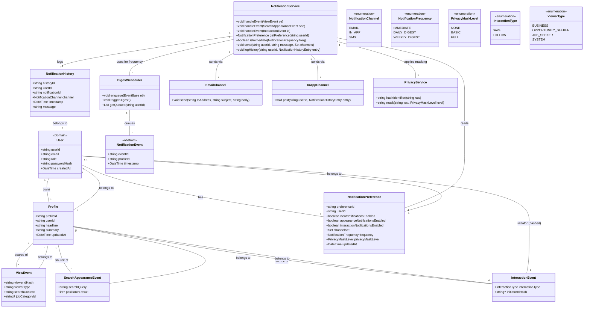

# Receive Notifications for Profile Views and Interactions — Structural View

Classes touched by this use case, refined from `rough-work.md` and verified by role-playing this use case's main flow against each card.

## CRC Cards

### User (as Job Seeker)
**Type:** Concrete, Domain  
**Description:** Actor who owns a profile and receives notifications about activity on that profile.  
**Associated Use Cases:** UC-001, UC-002, UC-003, UC-004, UC-005  

| Responsibilities | Collaborators |
|---|---|
| Authenticate via credentials | AuthenticationService |
| Access notification preferences | NotificationPreferenceService |
| View notification history | NotificationHistory |
| Mute or temporarily disable notifications | NotificationPreferenceService |

**Attributes:** userId(string), email(string), role(enum), passwordHash(string), createdAt(dateTime)  
**Relationships:**  
- One-to-one: Profile  
- One-to-one: NotificationPreference  
- Dependency: AuthenticationService, NotificationPreferenceService, NotificationHistory  

### Profile
**Type:** Concrete, Domain  
**Description:** Represents a job seeker’s professional profile; source of view/interaction events.  
**Associated Use Cases:** UC-001, UC-004, UC-005  

| Responsibilities | Collaborators |
|---|---|
| Store identifier for linking events | NotificationEvent, ViewEvent |
| Hold basic profile data (skills, experience, etc.) | — |

**Attributes:** profileId(string), userId(string), headline(string), summary(string), updatedAt(dateTime)  
**Relationships:**  
- One-to-one: User  
- One-to-many: ViewEvent (as the profile being viewed)  
- One-to-many: InteractionEvent (save/follow)  

### NotificationPreference
**Type:** Concrete, Domain  
**Description:** Stores a user’s choices for which event types trigger notifications, which channels are used, and frequency (immediate vs digest).  
**Associated Use Cases:** UC-005  

| Responsibilities | Collaborators |
|---|---|
| Indicate whether profile‑view notifications are enabled | NotificationService |
| Indicate whether search‑appearance notifications are enabled | NotificationService |
| Indicate whether interaction (save/follow) notifications are enabled | NotificationService |
| Store preferred channels (email, in‑app, SMS) | NotificationService |
| Store frequency setting (immediate, daily digest, weekly digest) | NotificationService |
| Store privacy masking preferences (hide viewer IDs, etc.) | PrivacyService |

**Attributes:** preferenceId(string), userId(string), viewNotificationsEnabled(boolean), appearanceNotificationsEnabled(boolean), interactionNotificationsEnabled(boolean), channelSet(Set<NotificationChannel>), frequency(NotificationFrequency), privacyMaskLevel(enum: NONE, BASIC, FULL), updatedAt(dateTime)  
**Relationships:**  
- Belongs to: User  
- Used by: NotificationService, PrivacyService  

### NotificationService
**Type:** Concrete, Service  
**Description:** Responsible for evaluating events, building messages, applying privacy controls, and delivering notifications via configured channels.  
**Associated Use Cases:** UC-005  

| Responsibilities | Collaborators |
|---|---|
| Listen for ViewEvent, SearchAppearanceEvent, InteractionEvent | EventListener (internal) |
| Retrieve user’s NotificationPreference | NotificationPreference |
| Determine if event should trigger immediate or digest notification | DigestScheduler |
| Build base notification message (event type, timestamp, etc.) | — |
| Apply privacy controls to message (mask identifiers, etc.) | PrivacyService |
| Send notification via each selected channel (email, in‑app, etc.) | EmailChannel, InAppChannel, etc. |
| Log sent notification in history | NotificationHistory |

**Attributes:** none  
**Relationships:**  
- Depends on: NotificationPreference, DigestScheduler, PrivacyService  
- Uses: EmailChannel, InAppChannel, NotificationHistory  
- Listens to: ViewEvent, SearchAppearanceEvent, InteractionEvent  

### DigestScheduler
**Type:** Concrete, Service  
**Description:** Accumulates events for users who have selected digest frequency and sends periodic summaries.  
**Associated Use Cases:** UC-005  

| Responsibilities | Collaborators |
|---|---|
| Store incoming events awaiting digest | — |
| Trigger digest generation at configured interval (daily/weekly) | — |
| Compile digest data (counts, categories, sample items) | NotificationService |
| Initiate digest send via NotificationService | NotificationService |

**Attributes:** none  
**Relationships:**  
- Used by: NotificationService  
- Manages: queued NotificationEvent objects  

### NotificationEvent
**Type:** Concrete, Domain  
**Description:** Abstract base class for all event types that can trigger a notification (view, appearance, interaction).  
**Associated Use Cases:** UC-005  

| Responsibilities | Collaborators |
|---|---|
| Provide timestamp of occurrence | — |
| Provide reference to affected profile | Profile |
| Provide optional details (viewer info, search context, interaction type) | — |

**Attributes:** eventId(string), profileId(string), timestamp(dateTime)  
**Relationships:**  
- Subclassed by: ViewEvent, SearchAppearanceEvent, InteractionEvent  

### ViewEvent (reused)
**Type:** Concrete, Domain  
**Description:** Record of a profile view (same as used in UC-004).  
**Associated Use Cases:** UC-004, UC-005  

| Responsibilities | Collaborators |
|---|---|
| Capture viewer identifier (hashed/pseudonymized) | PrivacyService |
| Record timestamp of view | — |
| Record search context (keywords/qualifications) | — |
| Record job category of viewer’s search (if applicable) | JobCategory |
| Link to viewed profile | Profile |

**Attributes:** eventId(string), profileId(string), viewerIdHash(string), viewerType(enum: BUSINESS, OPPORTUNITY_SEEKER, JOB_SEEKER, SYSTEM), searchContext(string), jobCategoryId(string, optional)  
**Relationships:**  
- Many-to-one: Profile  
- Many-to-one (optional): JobCategory  

### SearchAppearanceEvent
**Type:** Concrete, Domain  
**Description:** Record that a profile appeared in search results for a particular query.  
**Associated Use Cases:** UC-005  

| Responsibilities | Collaborators |
|---|---|
| Record the search query or qualifications that triggered appearance | — |
| Record timestamp of appearance | — |
| Link to viewed profile | Profile |
| Optionally record position in results | — |

**Attributes:** eventId(string), profileId(string), timestamp(dateTime), searchQuery(string), positionInResult(int, optional)  
**Relationships:**  
- Many-to-one: Profile  

### InteractionEvent
**Type:** Concrete, Domain  
**Description:** Record of an interaction (save or follow) on a profile.  
**Associated Use Cases:** UC-005  

| Responsibilities | Collaborators |
|---|---|
| Record interaction type (SAVE, FOLLOW) | — |
| Record timestamp of interaction | — |
| Link to interacting user (if known and allowed) | User (hashed/pseudonymized via PrivacyService) |
| Link to target profile | Profile |

**Attributes:** eventId(string), profileId(string), timestamp(dateTime), interactionType(enum: SAVE, FOLLOW), initiatorIdHash(string, optional)  
**Relationships:**  
- Many-to-one: Profile  
- Many-to-one (optional): User (initiator)  

### NotificationHistory
**Type:** Concrete, Domain  
**Description:** Immutable log of notifications sent to a user, useful for audit and UI history view.  
**Associated Use Cases:** UC-005  

| Responsibilities | Collaborators |
|---|---|
| Store notification identifier, timestamp, channel, and rendered message | — |
| Provide list of past notifications for UI | — |
| Support pagination / filtering by date or type | — |

**Attributes:** historyId(string), userId(string), notificationId(string), channel(NotificationChannel), timestamp(dateTime), message(string)  
**Relationships:**  
- Belongs to: User  

### EmailChannel
**Type:** Concrete, Infrastructure  
**Description:** Sends notifications via SMTP/email provider.  
**Associated Use Cases:** UC-005  

| Responsibilities | Collaborators |
|---|---|
| Render notification message with appropriate subject line | — |
| Send email to user’s registered address | — |
| Handle transient failures with retry logic | — |

**Attributes:** smtpHost(string), smtpPort(int), fromAddress(string)  
**Relationships:**  
- Used by: NotificationService  

### InAppChannel
**Type:** Concrete, Infrastructure  
**Description:** Posts notifications to the user’s in‑app notification centre.  
**Associated Use Cases:** UC-005  

| Responsibilities | Collaborators |
|---|---|
| Insert notification record into in‑app store | — |
| Signal UI to show badge/new item | — |

**Attributes:** none  
**Relationships:**  
- Used by: NotificationService  

### PrivacyService (reused)
**Type:** Concrete, Service  
**Description:** Applies pseudonymization and masking to protect personally identifiable information in notifications.  
**Associated Use Cases:** UC-004, UC-005  

| Responsibilities | Collaborators |
|---|---|
| Hash or pseudonymize viewer/company identifiers | — |
| Mask sensitive details in notification text | — |
| Ensure GDPR/CCPA compliance | — |

**Attributes:** none  
**Relationships:**  
- Used by: NotificationService, ViewEvent, InteractionEvent  

## Class diagram (this use case's slice)
