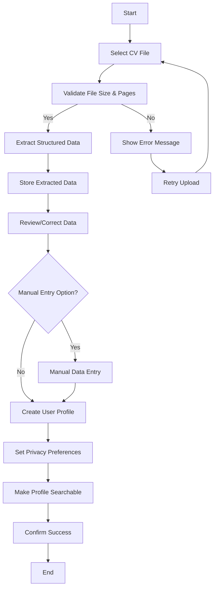

# Use Case: Upload CV and Create Searchable Profile

## Actors
- **Primary Actor**: Job Seeker
- **Secondary Actors**: System (for data extraction, storage, validation)

## Preconditions
- Job Seeker has accessed the CV upload functionality
- Job Seeker possesses a CV in a supported format (PDF, DOC, DOCX, TXT)
- System is operational and ready to process uploads

## Trigger
Job Seeker initiates the CV upload process by selecting a file and confirming upload.

## Main Flow
1. Job Seeker selects CV file and confirms upload
2. System accepts file upload in common formats (PDF, DOC, DOCX, TXT)
3. System validates file size (<= 5 MB) and page count (<= 5 pages)
4. System extracts structured information from CV (skills, experience, education, qualifications)
5. System stores extracted data in a searchable database format
6. System allows user to review and correct auto-extracted information
7. System creates a user profile from the captured/entered information
8. System enables profile to be made visible in search results (subject to privacy settings)
9. System confirms successful profile creation and searchability

## Alternate Flows
### A1: File Validation Fails
- If file size exceeds 5 MB or page count exceeds 5 pages at step 3:
  - System provides clear error message indicating limit exceeded
  - System prompts user to reduce file size or page count and retry
  - Use case returns to step 1

### A2: Data Extraction Issues
- If system cannot extract sufficient structured data at step 4:
  - System extracts what it can and flags low-confidence fields
  - System proceeds to step 6 for user review and correction
  - User can manually enter missing information

### A3: User Chooses Manual Entry
- At step 6, Job Seeker may choose to enter information manually instead of relying on auto-extraction
  - System provides manual entry form for skills, experience, education, qualifications
  - System validates entered data for basic consistency
  - System proceeds to step 7 with manually entered data

### A4: Privacy Preference Setting
- After step 7, before step 8:
  - Job Seeker can set privacy preferences for the profile (who can view, what information is visible)
  - System applies privacy settings to profile visibility

## Postconditions
- Job Seeker's CV has been successfully uploaded and processed
- Structured qualification data is stored in searchable format
- User profile is created and accessible to the Job Seeker
- Profile is discoverable in search results according to privacy settings
- System confirms successful completion to the User

## Business Rules
- **BR-001**: Only PDF, DOC, DOCX, TXT formats are accepted for CV upload
- **BR-002**: Maximum CV file size is 5 MB
- **BR-003**: Maximum CV pages is 5 pages
- **BR-004**: Extracted data must include at least one qualification field to proceed
- **BR-005**: Profiles must respect user-defined privacy settings before appearing in search results
- **BR-006**: System shall not extract or store sensitive information beyond professional qualifications

## Activity Diagram (Mermaid)
