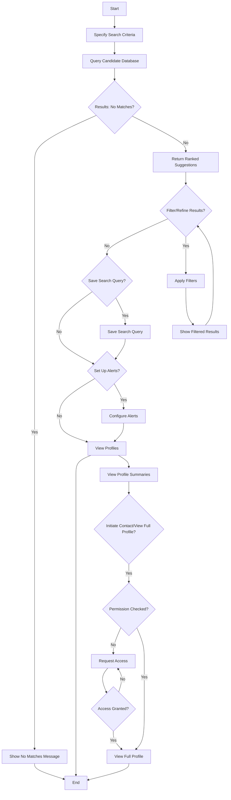

# Use Case: Search for Qualified Candidates and Receive Suggestions

## Actors
- **Primary Actor**: Business or Opportunity Seeker
- **Secondary Actors**: System (for search, matching, ranking)

## Preconditions
- Actor has accessed the search functionality
- System has indexed candidate profiles with qualification data
- At least one candidate profile exists in the system

## Trigger
Actor initiates a search for qualifications by specifying search criteria.

## Main Flow
1. Actor provides search criteria for qualifications, skills, experience, education
2. System queries candidate profile database based on search criteria
3. System returns ranked suggestions of matching candidates
4. Actor can filter and refine search results
5. Actor can save search query for future reuse
6. Actor can set up alerts for new matching candidates
7. Actor views candidate profile summaries (with privacy-protected sensitive information)
8. Actor can initiate contact or view full profile (subject to privacy settings and permissions)

## Alternate Flows
### A1: No Matching Candidates Found
- If query returns no results at step 3:
  - System informs actor that no candidates match the criteria
  - System suggests broadening search criteria or trying different qualifications
  - Use case ends

### A2: Refinement Leads to Empty Results
- If filtering/refinement at step 4 results in zero matches:
  - System shows no results message
  - System suggests adjusting filters or reverting to previous search state
  - Actor can modify filters and try again

### A3: Alert Configuration
- At step 6, when setting up alerts:
  - Actor specifies alert frequency (immediate, daily, weekly)
  - Actor specifies delivery method (email, in-app notification)
  - System confirms alert is active and will notify of new matches

### A4: Privacy-Protected Viewing
- At step 7, when viewing candidate profiles:
  - System displays only privacy-protected identifiers (e.g., "Tech Company in SF")
  - Sensitive information is hidden unless actor has appropriate permissions
  - Actor can request access to full profile (triggers permission request workflow)

## Postconditions
- Actor has executed a search for qualifications based on specified criteria
- System has returned ranked suggestions of matching candidates
- Actor has option to refine results, save search, or set up alerts
- Actor can view candidate profile summaries within privacy constraints
- System confirms search completion and any alert configurations

## Business Rules
- **BR-001**: Search shall support qualifications, skills, experience, education criteria
- **BR-002**: Search results shall be ranked by relevance to search criteria
- **BR-003**: Profile summaries shown in results shall protect sensitive information
- **BR-004**: Saved search queries can be reused with current data
- **BR-005**: Alerts trigger when new candidates matching saved criteria are added to system
- **BR-006**: Contact initiation or full profile viewing requires appropriate permissions
- **BR-007**: Privacy settings of candidate profiles shall be respected in all interactions

## Activity Diagram (Mermaid)
