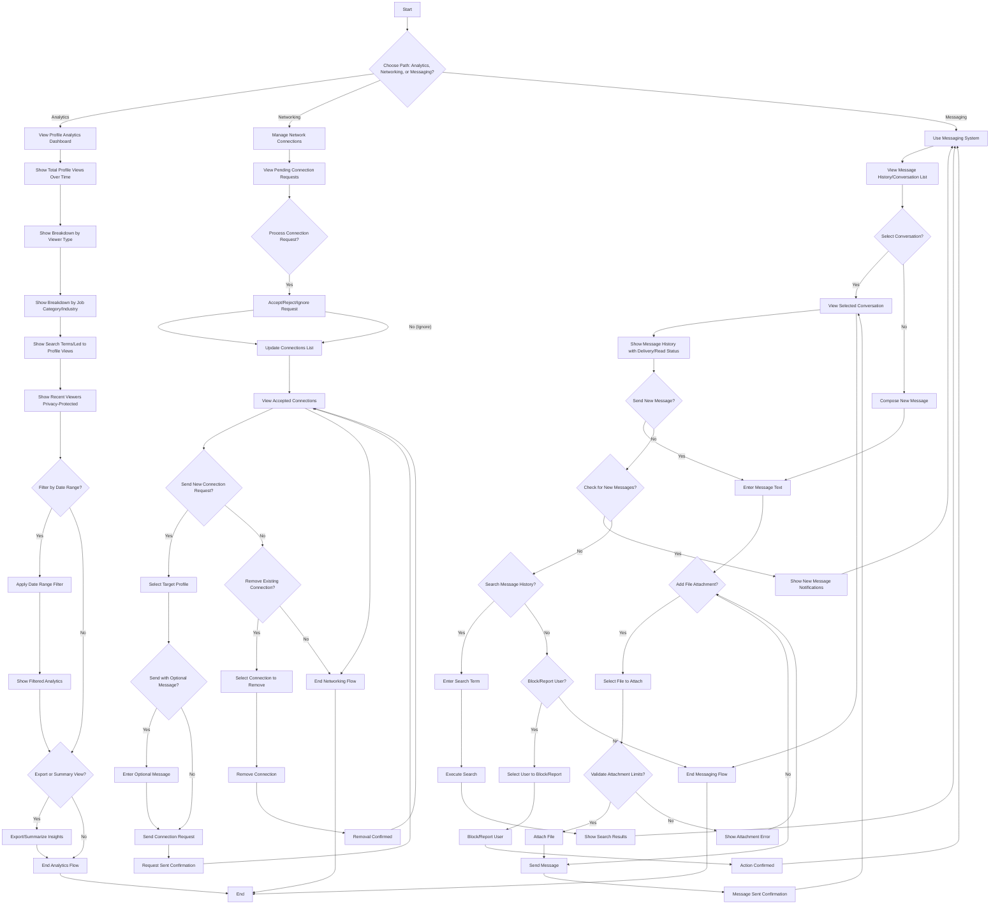

# Use Case: View Profile Analytics, Manage Network Connections, and Communicate

## Actors
- **Primary Actor**: User (Job Seeker or Business/Opportunity Seeker)
- **Secondary Actors**: System (for analytics, networking, messaging)

## Preconditions
- User has a profile in the system
- System has collected profile view data
- System supports networking and messaging functionality

## Trigger
User accesses the analytics dashboard, networking section, or messaging interface.

## Main Flow
### Analytics Viewing Path:
1. User navigates to profile analytics dashboard
2. System displays total profile views over time
3. System shows breakdown of views by viewer type (business, opportunity seeker, etc.)
4. System shows breakdown of views by job category/industry
5. System displays search terms or qualifications that led to profile appearing in results
6. System shows recent viewers with privacy-protected identifiers
7. User can filter insights by date range
8. User can export or view summary of insights

### Networking Path:
1. User navigates to networking/connections section
2. System displays pending connection requests
3. User can accept, reject, or ignore connection requests
4. System displays accepted connections in user's network view
5. User can send a connection request to another profile (optional message)
6. User can remove connections from their network

### Messaging Path:
1. User navigates to messaging interface
2. System displays message history in conversation view
3. System indicates message delivery and read status (sent, delivered, read)
4. User can send text messages to connected users
5. System supports file attachments within defined limits (e.g., max size 5 MB)
6. System provides notifications for new messages
7. User can search message history
8. User can block or report other users for inappropriate messages

## Alternate Flows
### A1: No Analytics Data Available
- If no profile view data exists:
  - System displays message indicating no analytics data available
  - System suggests that data will appear after profile receives views

### A2: Network Action Failed
- If sending connection request fails:
  - System provides error message with reason (e.g., user not found, already connected)
  - User can retry or cancel action

### A3: Message Send Failure
- If message fails to send:
  - System indicates message not sent
  - System provides option to retry or save as draft
  - System may show error (e.g., user not connected, blocked)

### A4: Attachment Limit Exceeded
- If file attachment exceeds limits:
  - System provides clear error message indicating limit exceeded
  - System prompts user to reduce file size or choose different file

## Postconditions
- User has viewed profile analytics with actionable insights
- User has managed network connections (sent, received, accepted, rejected, removed)
- User has sent and received messages with connected users
- System confirms completion of analytics viewing, networking actions, or messaging

## Business Rules
- **BR-001**: Analytics shall track profile view events (viewer entity type, timestamp, search context)
- **BR-002**: Profile summaries in analytics shall protect sensitive information
- **BR-003**: Users can only message users they are connected with
- **BR-004**: File attachments in messaging shall respect defined limits (size, type)
- **BR-005**: Users can block/report other users for inappropriate messages
- **BR-006**: Connection requests shall be asymmetric (one user sends, other accepts/rejects)
- **BR-007**: Analytics data shall respect viewer privacy settings

## Activity Diagram (Mermaid)
